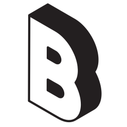

<div align="center">
  
  <h1 align="center">AI-Powered Personal Portfolio</h1>
  <p align="center">
    A dynamic and responsive portfolio built with React and Vite, featuring a custom-trained Gemini AI assistant.
    <br />
    <a href="https://github.com/BonyKoshy/Portfolio/issues">Report Bug</a>
    ·
    <a href="https://github.com/BonyKoshy/Portfolio/issues">Request Feature</a>
  </p>
</div>

<div align="center">

[![React][React.js]][React-url] [![Vite][Vite.js]][Vite-url] [![Tailwind][TailwindCSS]][Tailwind-url] [![Netlify][Netlify.com]][Netlify-url]

</div>

---

## About The Project


This is not just a static portfolio; it's a comprehensive single-page application designed to showcase my skills in a modern, interactive way. The core of this project is a seamless user experience, from fluid animations with Framer Motion to a fully functional AI assistant powered by Google's Gemini model.

The application is built with a focus on performance, security, and maintainability, utilizing a serverless architecture for the AI integration and configured as a Progressive Web App (PWA) for offline capabilities.

### ✨ Key Features

- **🤖 Gemini AI Assistant:** An interactive chatbot, powered by a Netlify serverless function, that's been custom-trained to answer questions about my skills, projects, and professional journey.
- **🌗 Light & Dark Mode:** A sleek, user-toggleable theme switcher that persists across sessions using `localStorage`.
- **📱 Fully Responsive Design:** A mobile-first approach ensures a pixel-perfect experience on all devices, from phones to desktops.
- **🚀 Progressive Web App (PWA):** The site is fully installable and features a service worker for asset caching and offline access.
- **Motion & Animation:** Smooth page transitions and micro-interactions are implemented with **Framer Motion** to create a dynamic and engaging UI.
- **📝 Serverless Form Handling:** The contact form uses Netlify's built-in form handling, submitted via a secure AJAX request.

---

## 🛠️ Tech Stack

This project is built with a modern and robust technology stack:

| Category       | Technology                                                         |
| :------------- | :----------------------------------------------------------------- |
| **Frontend**   | **React.js**, **Vite**, **JavaScript (ES6+)**, **HTML5**, **CSS3** |
| **Styling**    | **Tailwind CSS** (via Shadcn/UI), **Modular CSS**                  |
| **Animation**  | **Framer Motion**                                                  |
| **Backend**    | **Netlify Serverless Functions** (Node.js runtime)                 |
| **AI**         | **Google Gemini API** (`@google/generative-ai`)                    |
| **Deployment** | **Netlify**, **GitHub** (for CI/CD)                                |
| **Tooling**    | **ESLint**, **npm**                                                |

---

## 🚀 Getting Started

To get a local copy up and running, follow these simple steps.

### Prerequisites

You'll need to have [Node.js](https://nodejs.org/) (version 18.x or higher) and `npm` installed on your machine.

### Installation & Setup

1.  **Clone the repository:**
    ```sh
    git clone https://github.com/BonyKoshy/Portfolio.git
    ```
2.  **Navigate to the project directory:**
    ```sh
    cd Portfolio
    ```
3.  **Install NPM packages:**
    ```sh
    npm install
    ```
4.  **Set up environment variables:**
    - Create a `.env` file in the root of the project.
    - Add your Google Generative AI API key to this file:
      ```env
      VITE_GEMINI_API_KEY="YOUR_API_KEY_HERE"
      ```
5.  **Run the development server:**
    ```sh
    npm run dev
    ```
    Your local copy should now be running at `http://localhost:5173/`.

---

## 🗺️ Roadmap & Future Improvements

This project is actively maintained. Here are some of the planned features and enhancements:

- **✅ Comprehensive Testing Suite:**
  - [ ] Implement Unit Tests with Vitest.
  - [ ] Add Integration Tests with React Testing Library.
  - [ ] Introduce End-to-End tests with Playwright or Cypress.
- **🔒 Security Hardening:**
  - [ ] Implement a strict Content Security Policy (CSP).
- **🔧 Codebase Migration:**
  - [ ] Incrementally migrate the codebase from JavaScript to TypeScript for enhanced type safety.
- **🚀 Performance & Monitoring:**
  - [ ] Integrate Sentry for real-time error tracking.
  - [ ] Implement an automated image optimization pipeline.

See the [open issues](https://github.com/BonyKoshy/Portfolio/issues) for a full list of proposed features (and known issues).

---

[React.js]: https://img.shields.io/badge/React-20232A?style=for-the-badge&logo=react&logoColor=61DAFB
[React-url]: https://reactjs.org/
[Vite.js]: https://img.shields.io/badge/Vite-646CFF?style=for-the-badge&logo=vite&logoColor=white
[Vite-url]: https://vitejs.dev/
[TailwindCSS]: https://img.shields.io/badge/Tailwind_CSS-38B2AC?style=for-the-badge&logo=tailwind-css&logoColor=white
[Tailwind-url]: https://tailwindcss.com/
[Netlify.com]: https://img.shields.io/badge/Netlify-00C7B7?style=for-the-badge&logo=netlify&logoColor=white
[Netlify-url]: https://www.netlify.com/
