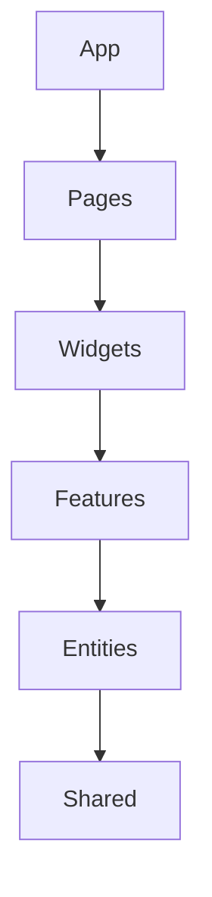

<div align="center">
  <h1 align="center">Bony Koshy | Infrastructure & Systems Engineer</h1>
  <p align="center">
    A production-grade frontend architecture proving scalable system design and performance.
    <br />
    <a href="https://github.com/BonyKoshy/Portfolio"><strong>Explore the docs »</strong></a>
    <br />
    <br />
    <a href="https://portfolio.bonykoshy.com">Live Demo</a>
    ·
    <a href="https://github.com/BonyKoshy/Portfolio/issues">Report Bug</a>
    ·
    <a href="https://github.com/BonyKoshy/Portfolio/issues">Request Feature</a>
  </p>
</div>

<div align="center">

[](https://react.dev/)
[](https://vitejs.dev/)
[](https://www.typescriptlang.org/)
[](https://tailwindcss.com/)
[](https://feature-sliced.design/)
[](https://opensource.org/licenses/MIT)

</div>

<div align="center">
  
</div>

---

## Overview

This project serves as a living proof-of-concept for high-performance web engineering. Rather than simply rendering a standard grid of portfolio projects, this repository demonstrates architectural competence, strict typing, and rendering optimization.

Built for the bleeding edge of the React ecosystem (React 19, Vite 8, Tailwind v4), the application is engineered around the principles of **Datacenter Minimalism**: precision, zero layout shift, high information density, and binary interaction states.

---

## Engineering Features

- **Feature-Sliced Architecture (FSD):** A strict, layered architectural methodology ensuring unidirectional dependencies and high maintainability as complexity scales.
- **Bleeding-Edge React Ecosystem:** Leveraging React 19's concurrent rendering features and the new experimental Babel React Compiler.
- **System-Aware Theme Engine:** A zero-FOUC (Flash of Unstyled Content) dark mode implementation using Datacenter Minimalism design tokens.
- **Headless Accessibility (A11y):** Built utilizing Radix UI primitives to ensure deep semantic structure, proper ARIA labeling, and keyboard navigation.
- **Dynamic Code Splitting:** Custom Rollup configurations via Vite (`manualChunks`) segmenting vendor libraries from application code to optimize cache hits and bundle parsing.
- **Automated Image Optimization:** Integrated `vite-plugin-image-optimizer` for lossless WebP/AVIF generation at build time.

---

## Architecture

The codebase adheres strictly to [Feature-Sliced Design (FSD)](https://feature-sliced.design/), decoupling business logic from UI and preventing spaghetti dependencies.


```mermaid
graph TD;
    App-->Pages;
    Pages-->Widgets;
    Widgets-->Features;
    Features-->Entities;
    Entities-->Shared;
```

### Component Layers

| Layer          | Purpose                                                     | Example                           |
| :------------- | :---------------------------------------------------------- | :-------------------------------- |
| **`app`**      | Global settings, initialization, routing, and providers.    | `ThemeProvider`, `App.tsx`        |
| **`pages`**    | Compositional layer for constructing full views.            | `HomeV2.tsx`, `Projects.tsx`      |
| **`widgets`**  | Self-contained UI blocks composed of entities and features. | `Navbar`, `Footer`, `HomeHero`    |
| **`features`** | Specific user interactions and business value operations.   | `ThemeToggle`, `ContactForm`      |
| **`entities`** | Business domain models and pure display components.         | `ProjectCard`, `CertificateBadge` |
| **`shared`**   | Reusable infrastructure code, UI kits, and utilities.       | `seo/`, `hooks/`, `ui/`           |

---

## Technology Stack

### Frontend Core

- **React 19** (Concurrent mode, Hooks, Suspense)
- **TypeScript** (Strict mode typing)
- **Vite 8** (Lightning-fast HMR and Rollup build pipeline)
- **React Router v7** (Client-side routing)

### Styling & Animation

- **Tailwind CSS 4** (Zero-runtime utility engine)
- **Framer Motion 12** (Declarative micro-interactions)
- **Radix UI** (Unstyled, accessible component primitives)
- **Lucide React** (Consistent iconography)

### Data Visualization

- **D3.js / Recharts / TopoJSON** (Geospatial and analytical data rendering)

### Code Quality & Tooling

- **ESLint v10** (Flat config, strict rules)
- **Prettier** (Opinionated code formatter)
- **Husky & lint-staged** (Pre-commit Git hooks ensuring repository hygiene)

---

## Project Structure

```text
.
├── src
│   ├── app/              # Global providers, routing, global CSS
│   ├── pages/            # View components mapping to routes
│   ├── widgets/          # Independent layout blocks (e.g., Nav, Hero sections)
│   ├── features/         # User interactions (e.g., project filters)
│   ├── entities/         # Business entities
│   ├── shared/           # Reusable UI, hooks, and configs
│   ├── App.tsx           # Root component
│   └── main.tsx          # React DOM entry point
├── public/               # Static assets
├── eslint.config.js      # ESLint configuration
├── vite.config.ts        # Vite & Rollup build configuration
└── package.json          # Dependencies and scripts
```

---

## Installation

### Prerequisites

- **Node.js**: v20 or higher
- **npm** (v10+)

### Setup

1. **Clone the repository:**

   ```bash
   git clone https://github.com/BonyKoshy/Portfolio.git
   cd Portfolio
   ```

2. **Install dependencies:**

   ```bash
   npm install
   ```

3. **Start the development server:**
   ```bash
   npm run dev
   ```
   The application will be available at `http://localhost:5173`.

### Production Build

```bash
npm run build
npm run preview
```

---

## Usage

The application relies on a modular Bento grid layout to display professional credentials.

> 🚧 _Note: Run the local server to interact with the high-contrast Datacenter Minimalism theme._

To add or modify pages, create a new composition in the `src/pages` directory and register the route in `src/app/App.tsx`.

---

## Engineering Decisions

### Why Feature-Sliced Design (FSD)?

Standard React architecture (e.g., group-by-file-type like `components`, `hooks`, `utils`) scales poorly in large applications, often leading to circular dependencies. FSD enforces strict, unidirectional module boundaries. A widget can import a feature, but a feature cannot import a widget. This makes the codebase self-documenting and easier to refactor.

### Why Vite over Next.js?

For a heavily client-side, animated application that doesn't strictly require edge-rendering for dynamic user data, Vite offers a significantly lighter, faster abstraction layer with instant HMR and minimal build overhead.

### Why Radix UI?

Rather than battling the specificity of a pre-styled library (like Material UI or Chakra), Radix UI provides the unstyled logic and state management for complex accessible components (Accordions, Tooltips, Modals), allowing the UI to be painted purely with Tailwind CSS for exact design token matching.

---

## Performance optimizations

- **React Compiler Integration:** Uses `babel-plugin-react-compiler` to automatically memoize components and hooks, eliminating manual `useMemo` / `useCallback` overhead.
- **Rollup Code Splitting:** Custom `manualChunks` configuration isolates `vendor` (React, Framer) and `ui` (Radix, Icons) from the main application payload, maximizing browser cache utilization between deployments.
- **Image Optimization:** Vite plugin (`vite-plugin-image-optimizer`) automatically compresses WebP, PNG, JPEG, and SVG assets during the build step for fast mobile loads.

---

## CI/CD & Automated Deployment

This repository uses an enterprise-grade **GitHub Actions CI/CD Pipeline** ([.github/workflows/ci-cd.yml](file:///.github/workflows/ci-cd.yml)) to guarantee quality, security, and automated production deployments.

### Multi-Stage Pipeline Architecture

```
Push to main ──► 1. 🔍 Validation (ESLint, Prettier, TypeScript) ──┐
             ──► 2. 🛡️ SCA (npm audit security scan)            ──┼──► 4. 📦 Build (Vite) ──► 5. 🧪 Smoke Test ──► 6. 🚀 Netlify Deploy
             ──► 3. 🛡️ SAST (GitHub CodeQL Security Analysis)  ──┘
```

1. **`validate`**: Code formatting (`prettier`), linting (`eslint`), and type checking (`tsc -b`).
2. **`sca`**: Software Composition Analysis checking for dependency vulnerabilities (`npm audit`).
3. **`sast`**: GitHub CodeQL Static Analysis scanning for JavaScript/TypeScript code vulnerabilities.
4. **`build`**: Production compilation (`vite build`) and artifact upload (`actions/upload-artifact@v4`).
5. **`integration`**: Smoke tests verifying `dist/index.html` and bundle assets before deployment.
6. **`deploy`**: Automated production deployment to Netlify via `nwtgck/actions-netlify@v3` (only runs if all prior steps pass).

### Setting Up Netlify Secrets in GitHub

To enable automated production deployments on `git push`:

1. Go to your GitHub repository **Settings -> Secrets and variables -> Actions**.
2. Add **`NETLIFY_AUTH_TOKEN`**: Personal Access Token from Netlify User Settings -> Personal access tokens.
3. Add **`NETLIFY_SITE_ID`**: Site API ID from Netlify Site Settings -> Site details.

## Contributing

This project is currently maintained as a personal engineering portfolio. However, suggestions regarding architectural improvements or FSD implementations are welcome via issues.

---

## License

Distributed under the MIT License. See `LICENSE` for more information.

---

## Author

**Bony Koshy**  
_Infrastructure & Systems Engineer_

- **GitHub:** [@BonyKoshy](https://github.com/BonyKoshy)
- **LinkedIn:** [Bony Koshy](https://linkedin.com/in/bonykoshy)
